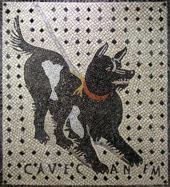

<div align="center">

# FAMILIA ROMANA



</div>

## Construcción

El libro puede, ademas de leerse en texto plano desde el código fuente, exporte a formatos de lectura comunes como lo son PDF, EPUB y en un futuro a una version web (HTML).

```bash
make book       # PDF
make ebook      # EPUB
```

## Progreso

| Capitulo | Contenido | Notas | Gramática | Ejercicios | Imágenes |
|----------|-----------|-------|-----------|------------|----------|
| I        | X         |       |           |            |          |
| II       | X         |       |           |            |          |
| III      | O         |       |           |            |          |
| IV       |           |       |           |            |          |
| V        |           |       |           |            |          |
| VI       |           |       |           |            |          |
| VII      |           |       |           |            |          |
| VIII     |           |       |           |            |          |
| IX       |           |       |           |            |          |
| X        |           |       |           |            |          |
| XI       |           |       |           |            |          |
| XII      |           |       |           |            |          |
| XIII     |           |       |           |            |          |
| XIV      |           |       |           |            |          |
| XV       |           |       |           |            |          |
| XVI      |           |       |           |            |          |
| XVII     |           |       |           |            |          |
| XVIII    |           |       |           |            |          |
| XIX      |           |       |           |            |          |
| XX       |           |       |           |            |          |
| XXI      |           |       |           |            |          |
| XXII     |           |       |           |            |          |
| XXIII    |           |       |           |            |          |
| XXIV     |           |       |           |            |          |
| XXV      |           |       |           |            |          |
| XXVI     |           |       |           |            |          |
| XXVII    |           |       |           |            |          |
| XXVIII   |           |       |           |            |          |
| XXIX     |           |       |           |            |          |
| XXX      |           |       |           |            |          |
| XXXI     |           |       |           |            |          |
| XXXII    |           |       |           |            |          |
| XXXIII   |           |       |           |            |          |
| XXXIV    |           |       |           |            |          |
| XXXV     |           |       |           |            |          |


